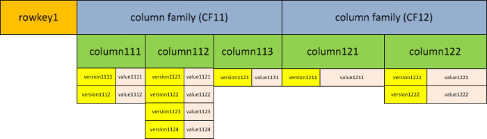
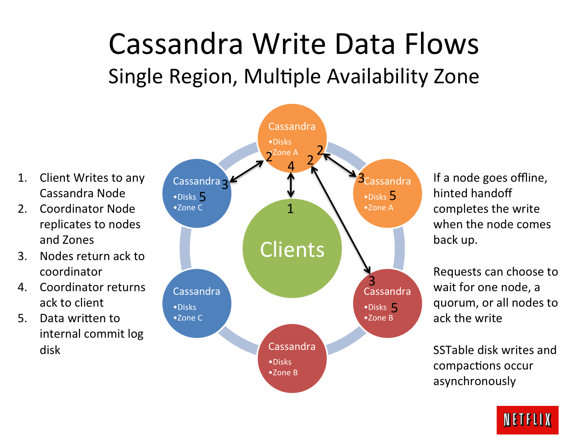
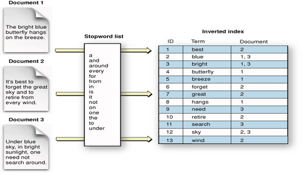

<!-- page_number: true -->
<!-- footer: Introduction à la Big Data -->

Introduction à la Big Data
===


##### Concept et historique

###### par [Fabien Barbaud](fabien.barbaud@timeonegroup.com) - [@BarbaudFabien](https://twitter.com/BarbaudFabien)

---

# Augmentation des capacités de stockage


---

# Concept : les 3V

- **Volume :**
téra ($10^{12}$), péta ($10^{15}$), exa ($10^{18}$), zetta ($10^{21}$), yotta ($10^{24}$)
- **Variété :**
Profil, activité, interaction, statistique, image, voix, ...
- **Vélocité :**
Temps réel, milliseconde, haute fréquence, ...

---
# Concept : les 3V

## Volume


[The Zettabyte Era: Trends and Analysis](https://www.cisco.com/c/en/us/solutions/collateral/service-provider/visual-networking-index-vni/vni-hyperconnectivity-wp.html)

---

# Concept : les 3V

## Volume


[Be a Smarter Business by Unlocking your Internet of Things](http://mqug.org.uk/downloads/201407/201407%20-%20MQM03%20-%20Smarter%20Business%20by%20Unlocking%20IoT.pdf)

---

# Concept : les 3V

## Variété

Produit
```json
{
  "_id": {
    "$oid": "5968dd23fc13ae04d9000001"
  },
  "product_name": "sildenafil citrate",
  "supplier": "Wisozk Inc",
  "quantity": 261,
  "unit_cost": "$10.47"
}
```

[10 Example JSON Files](https://www.sitepoint.com/10-example-json-files/)

---

# Concept : les 3V

## Variété

GeoIP
```json
{
  "as": "AS16509 Amazon.com, Inc.",
  "city": "Boardman",
  "country": "United States",
  "countryCode": "US",
  "isp": "Amazon",
  "lat": 45.8696,
  "lon": -119.688,
  ...
  "regionName": "Oregon",
  "status": "success",
  "timezone": "America\/Los_Angeles",
  "zip": "97818"
}
```

---

# Concept : les 3V

## Variété

Twitter
```json
{
  "created_at": "Thu Jun 22 21:00:00 +0000 2017",
  "id": 877994604561387500,
  "id_str": "877994604561387520",
  "text": "....",
  "entities": {
    "hashtags": [{
      ...
    }],
    "user_mentions": [],
    "urls": [{
      "url": "https://t.co/xFox78juL1",
      ...
    }]
  }
```

---

# Concept : les 3V

## Variété

WordPress
```json
{
  "id": 157538,
  "date": "2017-07-21T10:30:34",
  "date_gmt": "2017-07-21T17:30:34",
  "guid": {
     "rendered": "https://www.sitepoint.com/?p=157538"
  },
  "modified": "2017-07-23T21:56:35",
  "modified_gmt": "2017-07-24T04:56:35",
  "slug": "why-the-iot-threatens-your-wordp..",
  "status": "publish",
  "type": "post",
  "link": "https://www.sitepoint.com/why-the-io...",
```

---

# Concept : les 3V

## Vélocité


---

# Et les autres

- **Variabilité** 
- **Véracité**
- **Visualisation**
- **Valeur**

---

# Hadoop

## La démocratisation de la "Big Data"


- 2004
- Doug Cutting
- Framework
- Java
- Doudou

---

# Hadoop

## En résumé

***Hadoop*** est un *framework* libre et *open source* écrit en Java destiné à faciliter la création d'applications distribuées (au niveau du stockage des données et de leur traitement) et échelonnables (scalables) permettant aux applications de travailler avec des milliers de nœuds et des pétaoctets de données.
[...] *Hadoop* a été inspiré par la publication de *MapReduce*, *GoogleFS* et *BigTable* de Google
[Wikipedia](https://fr.wikipedia.org/wiki/Hadoop)

---

# Hadoop

## L'architecture

- *Hadoop Distributed File System* (HDFS)
- *YARN*
- *MapReduce*

---

# Hadoop

## HDFS


[HDFS Architecture Guide](https://hadoop.apache.org/docs/current/hadoop-project-dist/hadoop-hdfs/HdfsDesign.html)

---

# Hadoop

## HDFS

- ***NameNode :*** gestion de l'espace de noms, de l'arborescence et des métadonnées
- ***DataNode :*** stockage des blocs de données

---

# Hadoop

## HDFS - Quelques commandes

```bash
hadoop fs -mkdir
hadoop fs -ls
hadoop fs -put
hadoop fs -get
hadoop fs -cp
hadoop fs -mv
...
```

---

# Hadoop

## HDFS - Exercice pratique

```
$ git clone https://github.com/fabienbarbaud/docker-hadoop.git
$ cd docker-hadoop
$ docker-compose up -d
$ docker-compose run --rm client bash
root@0f0355fc41b0:/# hadoop version
root@0f0355fc41b0:/# hdfs dfs -mkdir /input
root@0f0355fc41b0:/# hdfs dfs -ls /
```

Fork https://github.com/big-data-europe/docker-hadoop

---

# Hadoop

## YARN


[Apache Hadoop YARN](https://hadoop.apache.org/docs/current/hadoop-yarn/hadoop-yarn-site/YARN.html)

---

# Hadoop

## YARN

- ***Resource Manager :*** arbitre la gestion des ressources au sein du cluster
- ***Node Manager :*** fournit les ressources du nœud sous forme de *Container*
- ***Application Master :*** coordonne l'exécution des tâches
- ***Container :*** exécute les tâches

---

# Hadoop

## MapReduce


[Wikipedia](https://upload.wikimedia.org/wikipedia/commons/thumb/6/6d/Mapreduce.png/500px-Mapreduce.png)

*input* (k1, v1) 
-> **map** -> (k2, v2) 
-> **combine** -> (k2, v2) 
-> **reduce** -> (k3, v3) 
*output*

---

# Hadoop

## Par l'exemple : WordCount

Input (flux d'entrée) :

```text
Conseil tenu par les rats

Un chat, nommé Rodilardus,
Faisait des rats telle déconfiture
Que l'on n'en voyait presque plus,
Tant il en avait mis dedans la sépulture.
Le peu qu'il en restait n'osant quitter son trou
...
```

---

# Hadoop

## Par l'exemple : WordCount

Mapper :

```python
import sys

for input_line in sys.stdin:
    input_line = input_line.strip()
    keys = input_line.split()
    for key in keys:
        value = 1
        print('%s\t%d' % (key, value))
```

---

# Hadoop

## Par l'exemple : WordCount

Reducer :

---

```python
import sys

last_key = None
running_total = 0

for input_line in sys.stdin:
    input_line = input_line.strip()
    this_key, value = input_line.split("\t", 1)
    value = int(value)

    if last_key == this_key:
        running_total += value
    else:
        if last_key:
            print("%s\t%d" % (last_key, running_total))
        running_total = value
        last_key = this_key

if last_key == this_key:
    print("%s\t%d" % (last_key, running_total))
```

---

# Hadoop

## Par l'exemple : WordCount

```
root@0f0355fc41b0:/# cd /files/wordcount
root@0f0355fc41b0:/files/wordcount# cat conseil-tenu-par-les-rats.txt | ./mapper.py | sort | ./reducer.py
```

```
root@0f0355fc41b0:/files/wordcount# hdfs dfs -mkdir /wordcount
root@0f0355fc41b0:/files/wordcount# hdfs dfs -put conseil-tenu-par-les-rats.txt /wordcount/fable.txt
root@0f0355fc41b0:/files/wordcount# hadoop jar /opt/hadoop-3.2.1/share/hadoop/tools/lib/hadoop-streaming-3.2.1.jar \
 -mapper "mapper.py" \
 -reducer "reducer.py" \
 -file "mapper.py" \
 -file "reducer.py" \
 -input "/wordcount/fable.txt" \
 -output "/wordcount/output"
```

```
root@0f0355fc41b0:/files/wordcount# hdfs dfs -cat /wordcount/output/*
```

---

# Hadoop

## Exercice

- Récupérez une source de données sur [data.gouv.fr](https://www.data.gouv.fr/fr/)
- Importez ces données en HDFS
- Développez un code *MapReduce* en Python pour en extraire une nouvelle information

---

# Base de données et Big Data

## Les principes fondamentaux

- ***Partitioning*** : basé sur les colonnes
- ***Sharding*** : basé sur les clés d'une ligne

---

# Base de données et Big Data

## Partitioning

| Col1 | Col2 | Col3 | Col4 | Col5 | Col6 |
| --- | --- | --- | --- | --- | --- |
| _ |  |  | | | | 

__

| Col1 | Col2 | Col3 | Col4 |
| --- | --- | --- | --- |
| _ |  |  | |

| Col5 | Col6 |
| --- | --- |
| _ |  |

---

# Base de données et Big Data

## Sharding - Horizontal partitioning

| Key | Col1 | Col2 | Col3 |
| --- | --- | --- | --- |
| x |  |  | |
| y |  |  | |
| z |  |  | |

| Key | Col1 | Col2 | Col3 |
| --- | --- | --- | --- |
| x |  |  | |

| Key | Col1 | Col2 | Col3 |
| --- | --- | --- | --- |
| y |  |  | |
| z |  |  | |

---

# HBase


- Base de données orientée colonnes
- Installé sur le système de fichier HDFS

---

# HBase

## Système de stockage



[HBase Schema](https://goranzugic.wordpress.com/2016/04/11/hbase-schema/)

---

# HBase

## Système de stockage

- Une *table* est une collection de *rows*
- Une *row* est une collection de *columns family*
- Une *column family* est une collection de *columns*
- Une *column* est une collection de clé/valeur 

---

# HBase

## Système de stockage

```json
{
"row1": {"1": {"color": "green",
               "size": 25},
         "2": {"weight": 52,
               "size": 18}
        },
"row2": {"1": {"color": "blue"},
         "2": {"height": 192,
               "size": 43}
        }
}
```

---

# HBase

## HBase Shell

```
$ docker pull dajobe/hbase
$ mkdir data
$ docker run --name=hbase-docker -h hbase-docker -d \
-v $PWD/data:/data dajobe/hbase
$ docker exec -it hbase-docker bash
root@hbase-docker:/# hbase shell
```

---

# HBase

## HBase Shell

[HBase Tutorial](https://www.tutorialspoint.com/hbase/hbase_security.htm)

```
> status
1 active master, 0 backup masters, 1 servers, 1 dead, 2.0000 average load
```

```
> list
TABLE
0 row(s) in 0.0820 seconds

=> []
```

---

# HBase

## HBase Shell - Création d'une table

```
> create 'emp', 'personal data', 'professional data'
0 row(s) in 1.3160 seconds

=> Hbase::Table - emp
```

```
> list
TABLE
emp
1 row(s) in 0.0440 seconds

=> ["emp"]
```

---

# HBase

## HBase Shell - Désactivation

```
> disable 'emp'
0 row(s) in 2.3980 seconds
```

```
> is_disabled 'emp'
true
0 row(s) in 0.0110 seconds
```

---

# HBase

## HBase Shell - Activation

```
> enable 'emp'
0 row(s) in 1.3110 seconds
```

```
> is_enabled 'emp'
true
0 row(s) in 0.0280 seconds
```

---

# HBase

## HBase Shell - Ecriture

```
> put 'emp','1','personal data:name','raju'
> put 'emp','1','personal data:city','hyderabad'
> put 'emp','1','professional data:designation','manager'
> put 'emp','1','professional data:salary','50000'
```

```
> scan 'emp'
```

---

# HBase

## HBase Shell - Mise à jour

```
> put 'emp','1','personal data:city','Delhi'
ROW  COLUMN+CELL
 1   column=personal data:city, timestamp=1503511522300, value=Delhi
 1   column=personal data:name, timestamp=1503511282272, value=raju
 1   column=professional data:designation, timestamp=1503511332216, value=manager
 1   column=professional data:salary, timestamp=1503511341265, value=50000
1 row(s) in 0.0250 seconds
```

---

# HBase

## HBase Shell - Accès

```
> get 'emp', '1'
COLUMN                           CELL
 personal data:city              timestamp=1503511522300, value=Delhi
 personal data:name              timestamp=1503511282272, value=raju
 professional data:designation   timestamp=1503511332216, value=manager
 professional data:salary        timestamp=1503511341265, value=50000
4 row(s) in 0.0610 seconds
```

---

# HBase

## HBase Shell - Accès à une colonne

```
> get 'emp', '1', {COLUMN => 'personal data:name'}
COLUMN                 CELL
 personal data:name    timestamp=1503511282272, value=raju
1 row(s) in 0.0250 seconds
```

---

# HBase

## HBase Shell - Suppression

```
> delete 'emp', '1', 'personal data:city'
> deleteall 'emp','1'
> scan 'emp'
```

---

# HBase

## HBase Shell - Sécurité

- **R** lecture
- **W** écriture
- **X** exécution
- **C** création
- **A** admin

```
> grant 'bobsmith', 'RWXCA'
> revoke 'bobsmith'
```

---

# Cassandra


- Tolérance à la panne
- Décentralisé
- Scalable

---



[Netflix Architecture Tutorial](https://www.slideshare.net/adrianco/netflix-architecture-tutorial-at-gluecon)

---

# Cassandra

## Tutorial

```
$ docker pull cassandra
$ docker run --name=cassandra -d library/cassandra
$ docker exec -it cassandra bash
root@a6b74edad198:/#
```

[Cassandra Tutorial](https://www.tutorialspoint.com/cassandra/index.htm)

---

# Cassandra

## cqlsh

```
root@dce317a979a6:/# cqlsh
Connected to Test Cluster at 127.0.0.1:9042.
[cqlsh 5.0.1 | Cassandra 3.11.4 | CQL spec 3.4.4 | Native protocol v4]
Use HELP for help.
cqlsh>
```

Cassandra Query Language (CQL)

---

# Cassandra

## Keyspace

```
cqlsh> CREATE KEYSPACE tutorialspoint
WITH replication = {'class':'SimpleStrategy', 
'replication_factor' : 3};
cqlsh> DESCRIBE keyspaces;
```

---

# Cassandra

## Table

```
cqlsh> USE tutorialspoint;
cqlsh:tutorialspoint> CREATE TABLE emp(
   emp_id int PRIMARY KEY,
   emp_name text,
   emp_city text,
   emp_sal varint,
   emp_phone varint
   );
cqlsh:tutorialspoint> select * from emp;
```

---

# Cassandra

## Créer

```
cqlsh:tutorialspoint> INSERT INTO emp 
(emp_id, emp_name, emp_city, emp_phone, emp_sal) 
VALUES (1,'ram', 'Hyderabad', 9848022338, 50000);
cqlsh:tutorialspoint> INSERT INTO emp 
(emp_id, emp_name, emp_city, emp_phone, emp_sal) 
VALUES (2,'robin', 'Hyderabad', 9848022339, 40000);
cqlsh:tutorialspoint> INSERT INTO emp 
(emp_id, emp_name, emp_city, emp_phone, emp_sal) 
VALUES (3,'rahman', 'Chennai', 9848022330, 45000);
cqlsh:tutorialspoint> SELECT * FROM emp;
```

---

# Cassandra

## Mettre à jour

```
cqlsh:tutorialspoint> UPDATE emp 
SET emp_city='Delhi',emp_sal=50000
WHERE emp_id=2;
cqlsh:tutorialspoint> SELECT * FROM emp;
```

---

# Cassandra

## Lire

```
cqlsh:tutorialspoint> SELECT emp_name, emp_sal from emp;
cqlsh:tutorialspoint> SELECT * FROM emp WHERE emp_sal=50000;
cqlsh:tutorialspoint> CREATE INDEX ON emp(emp_sal);
cqlsh:tutorialspoint> SELECT * FROM emp WHERE emp_sal=50000;
```

---

# Cassandra

## Supprimer

```
cqlsh:tutorialspoint> DELETE emp_sal FROM emp WHERE emp_id=3;
cqlsh:tutorialspoint> SELECT * FROM emp;
cqlsh:tutorialspoint> DELETE FROM emp WHERE emp_id=3;
cqlsh:tutorialspoint> SELECT * FROM emp;
```

---

# Elasticsearch


- Indexation et recherche de données
- Moteur [Lucene](https://fr.wikipedia.org/wiki/Lucene)
- *API HTTP RESTful* en *JSON*

---

# Elasticsearch



[Elasticsearch Tutorial - Elasticsearch Storage Architecture : Analysis and Inverted Indexes](http://siddhumehta.blogspot.fr/2014/06/elasticsearch-tutorial-inverted-index.html)

---

# Elasticsearch

## Tutorial

```text
$ git clone https://github.com/fabienbarbaud/docker-elasticsearch.git
$ cd docker-elasticsearch
$ docker-compose up
```

http://localhost:5601

[Elasticsearch Tutorial](https://www.tutorialspoint.com/elasticsearch/index.htm)
