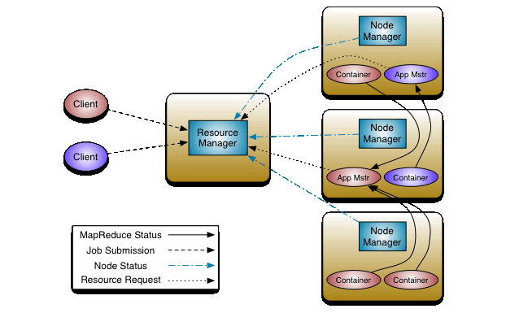

<!-- page_number: true -->
<!-- footer: Introduction à la Big Data -->

Introduction à la Big Data
===


##### Concept et historique

###### par [Fabien Barbaud](fabien.barbaud@timeonegroup.com) - [@BarbaudFabien](https://twitter.com/BarbaudFabien)

---

# Augmentation des capacités de stockage


---

# Concept : les 3V

- **Volume :**
téra ($10^{12}$), péta ($10^{15}$), exa ($10^{18}$), zetta ($10^{21}$), yotta ($10^{24}$)
- **Variété :**
Profil, activité, interaction, statistique, image, voix, ...
- **Vélocité :**
Temps réel, milliseconde, haute fréquence, ...

---
# Concept : les 3V

## Volume


[The Zettabyte Era: Trends and Analysis](https://www.cisco.com/c/en/us/solutions/collateral/service-provider/visual-networking-index-vni/vni-hyperconnectivity-wp.html)

---

# Concept : les 3V

## Volume


[Be a Smarter Business by Unlocking your Internet of Things](http://mqug.org.uk/downloads/201407/201407%20-%20MQM03%20-%20Smarter%20Business%20by%20Unlocking%20IoT.pdf)

---

# Concept : les 3V

## Variété

Produit
```json
{
  "_id": {
    "$oid": "5968dd23fc13ae04d9000001"
  },
  "product_name": "sildenafil citrate",
  "supplier": "Wisozk Inc",
  "quantity": 261,
  "unit_cost": "$10.47"
}
```

[10 Example JSON Files](https://www.sitepoint.com/10-example-json-files/)

---

# Concept : les 3V

## Variété

GeoIP
```json
{
  "as": "AS16509 Amazon.com, Inc.",
  "city": "Boardman",
  "country": "United States",
  "countryCode": "US",
  "isp": "Amazon",
  "lat": 45.8696,
  "lon": -119.688,
  ...
  "regionName": "Oregon",
  "status": "success",
  "timezone": "America\/Los_Angeles",
  "zip": "97818"
}
```

---

# Concept : les 3V

## Variété

Twitter
```json
{
  "created_at": "Thu Jun 22 21:00:00 +0000 2017",
  "id": 877994604561387500,
  "id_str": "877994604561387520",
  "text": "....",
  "entities": {
    "hashtags": [{
      ...
    }],
    "user_mentions": [],
    "urls": [{
      "url": "https://t.co/xFox78juL1",
      ...
    }]
  }
```

---

# Concept : les 3V

## Variété

WordPress
```json
{
  "id": 157538,
  "date": "2017-07-21T10:30:34",
  "date_gmt": "2017-07-21T17:30:34",
  "guid": {
     "rendered": "https://www.sitepoint.com/?p=157538"
  },
  "modified": "2017-07-23T21:56:35",
  "modified_gmt": "2017-07-24T04:56:35",
  "slug": "why-the-iot-threatens-your-wordp..",
  "status": "publish",
  "type": "post",
  "link": "https://www.sitepoint.com/why-the-io...",
```

---

# Concept : les 3V

## Vélocité


---

# Et les autres

- **Variabilité** 
- **Véracité**
- **Visualisation**
- **Valeur**

---

# Hadoop

## La démocratisation de la "Big Data"


- 2004
- Doug Cutting
- Framework
- Java
- Doudou

---

# Hadoop

## En résumé

***Hadoop*** est un *framework* libre et *open source* écrit en Java destiné à faciliter la création d'applications distribuées (au niveau du stockage des données et de leur traitement) et échelonnables (scalables) permettant aux applications de travailler avec des milliers de nœuds et des pétaoctets de données.
[...] *Hadoop* a été inspiré par la publication de *MapReduce*, *GoogleFS* et *BigTable* de Google
[Wikipedia](https://fr.wikipedia.org/wiki/Hadoop)

---

# Hadoop

## L'architecture

- *Hadoop Distributed File System* (HDFS)
- *YARN*
- *MapReduce*

---

# Hadoop

## HDFS


[HDFS Architecture Guide](https://hadoop.apache.org/docs/current/hadoop-project-dist/hadoop-hdfs/HdfsDesign.html)

---

# Hadoop

## HDFS

- ***NameNode :*** gestion de l'espace de noms, de l'arborescence et des métadonnées
- ***DataNode :*** stockage des blocs de données

---

# Hadoop

## HDFS - Quelques commandes

```bash
hadoop fs -mkdir
hadoop fs -ls
hadoop fs -put
hadoop fs -get
hadoop fs -cp
hadoop fs -mv
...
```

---

# Hadoop

## HDFS - Exercice pratique

```
$ docker pull sequenceiq/hadoop-docker:2.7.1
$ docker run -it sequenceiq/hadoop-docker:2.7.1 \
  /etc/bootstrap.sh -bash
bash-4.1# cd $HADOOP_PREFIX
bash-4.1# bin/hadoop version
bash-4.1# bin/hadoop fs -mkdir test
bash-4.1# bin/hadoop fs -ls
bash-4.1# bin/hadoop fs
```

https://github.com/sequenceiq/hadoop-docker

---

# Hadoop

## YARN



[Apache Hadoop YARN](https://hadoop.apache.org/docs/current/hadoop-yarn/hadoop-yarn-site/YARN.html)

---

# Hadoop

## YARN

- ***Resource Manager :*** arbitre la gestion des ressources au sein du cluster
- ***Node Manager :*** fournit les ressources du nœud sous forme de *Container*
- ***Application Master :*** coordonne l'exécution des tâches
- ***Container :*** exécute les tâches

---

# Hadoop

## YARN - Web UI

```
$ docker run -p 8088:8088 -it sequenceiq/hadoop-docker:2.7.1 \
  /etc/bootstrap.sh -bash
```

http://host:8088

---

# Hadoop

## MapReduce


[Wikipedia](https://upload.wikimedia.org/wikipedia/commons/thumb/6/6d/Mapreduce.png/500px-Mapreduce.png)

---

# Hadoop

## Par l'exemple : WordCount

Input (flux d'entrée) :

```text
Conseil tenu par les rats

Un chat, nommé Rodilardus,
Faisait des rats telle déconfiture
Que l'on n'en voyait presque plus,
Tant il en avait mis dedans la sépulture.
Le peu qu'il en restait n'osant quitter son trou
...
```

---

# Hadoop

## Par l'exemple : WordCount

Mapper :

```python
import sys

for line in sys.stdin:
    line = line.strip()
    keys = line.split()
    for key in keys:
        value = 1
        print('%s\t%d' % (key, value))
```


